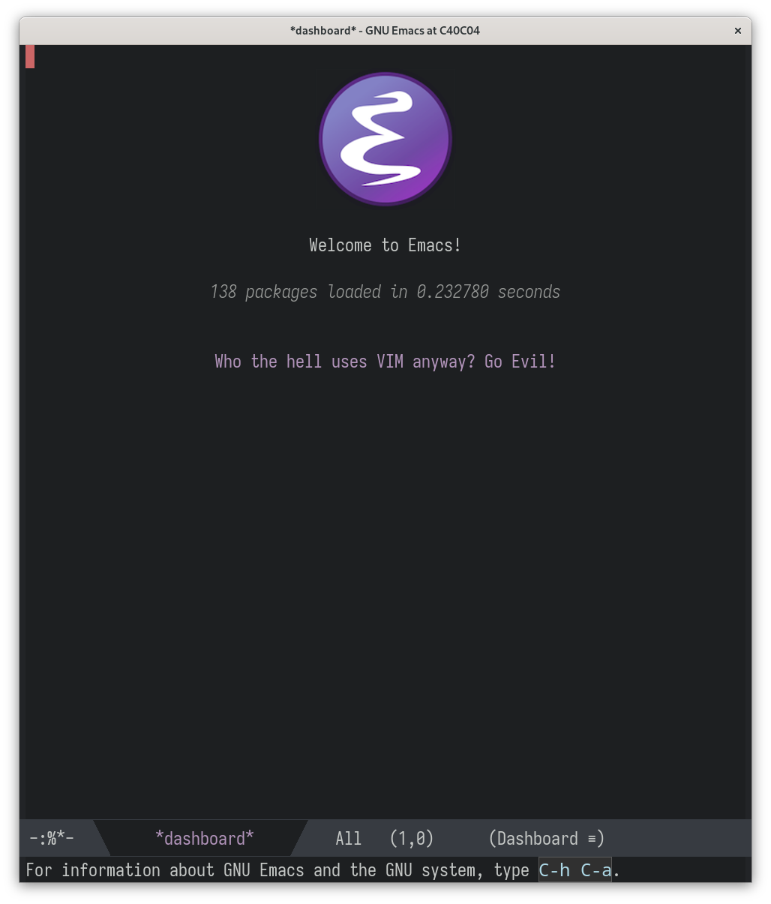

#+TITLE:Emacs configuration
#+AUTHOR: 胡雨軒 Петр
#+LANGUAGE: en

* Choosing an Emacs build on macOS

#+BEGIN_SRC zsh :tangle no
brew install --cask emacs@nightly
#+END_SRC

* How to get help

These are the most important keystrokes of all. If you know these keys
keystrokes, you can get helpful information whenever you are stuck!
These keystrokes are far more helpful than Google.

- =C-h(elp) b(indings)= shows the keybindings available in the current
  buffer.
- =C-h(elp) d(ocumentation)= lets you search through all available
  documentation.
- =C-h(elp) f(unction)= displays the current list of available
  functions.
- =C-h(elp) i(nfo)= shows the info docs installed on your computer (no
  need to have a browser open just to read documentation).
- =C-h(elp) m(ode)= shows information about all the modes in the
  buffer.
- =C-h(elp) k(ey)= let’s you type a keystroke and find out what it
  does.
- =C-h(elp) v(ariable)= displays the list of available variables.

* Table of contents :TOC_2_org:
- [[Choosing an Emacs build on macOS][Choosing an Emacs build on macOS]]
- [[How to get help][How to get help]]
- [[Philosophy][Philosophy]]
- [[Key features][Key features]]
  - [[User experience][User experience]]
  - [[Writing & Programming Environment][Writing & Programming Environment]]
  - [[Interacting with the outside world][Interacting with the outside world]]

* Philosophy

My approach to configuration is guided by a few core principles:

- *Simplicity (KISS)*: Most systems work best when they are kept
  simple. This configuration avoids unnecessary complexity and doesn't
  require a special mindset to use or modify. It's a document first,
  not an automated deployment script.
- *Locality*: I believe that related settings should be close to each
  other. This entire setup is self-contained in one place to make it
  easy to understand and maintain without hidden dependencies or side
  effects.
- *Predictability*: My environment should behave consistently, and I
  want the ability to revert to a a previous state if something goes
  wrong. Versioning this repository with Git makes that possible.
- *Declarativeness*: I want to keep a record of the reasoning that led
  to my configuration choices. Literate programming helps me document
  these decisions for my future self and for anyone else who might
  find this useful.

* Key features

This Emacs setup is designed to be a powerful and ergonomic
environment for both writing and programming. Here are some of the
highlights:

** User experience

- *Performance-orientated*: The configuration is optimized for a fast
  startup, with garbage collection settings tuned to be less invasive
  during initialization.
- *Ergonomic keybindings*: Sensible, discoverable keybindings with
  =which-key= showing available completions on demand.
- *Modern aesthetics*: A clean, minimalist UI with an adaptive
  dark/light theme (=sanityinc-tomorrow= via =auto-dark=), beautiful
  fonts with ligature support (=Iosevka= + =ligature=), and a rich
  mode line powered by =doom-modeline=.
- *Efficient navigation*: A powerful completion framework built on
  =vertico=, =consult=, =embark=, =orderless=, and =marginalia=
  provides a consistent interface for finding files, switching buffers,
  and executing commands.

** Writing & Programming Environment

- *LSP integration*: Uses =eglot= for seamless Language Server
  Protocol support, providing intelligent code completion,
  diagnostics, and navigation across various languages, with
  =eglot-java= for Java and =dape= for DAP-based debugging.
- *Advanced code parsing*: Leverages the built-in =tree-sitter= for
  fast and accurate syntax highlighting and =treesit-fold= for code
  folding, which is more robust than traditional regex-based
  approaches.
- *Powerful completion*: A rich in-buffer completion experience
  provided by =corfu= with =cape= for additional completion-at-point
  extensions, and =yasnippet= for snippet expansion.
- *Git integration*: Deep integration with Git through =Magit=, along
  with =git-gutter= to show changes in the fringe and =forge= for
  GitHub/GitLab interaction.
- *Code formatting*: =apheleia= runs formatters asynchronously on
  save, keeping buffers clean without blocking editing.
- *Writing aids*: =jinx= for spell checking, =writeroom-mode= for
  distraction-free writing, and =org-modern= / =org-appear= for a
  polished Org experience.
- *Language-specific support*: Tailored setups for Clojure (=cider=,
  =clj-refactor=), Python (=elpy=, =poetry=), Rust (=rust-mode=,
  =cargo-mode=), LaTeX (=AUCTeX=, =cdlatex=), Nix (=nix-mode=), Java
  (=eglot-java=), Dockerfile, and Shell scripting.

** Interacting with the outside world

- *Integrated shell emulator*: Features =eat= (Emacs Application
  Toolkit), a powerful terminal emulator that integrates seamlessly
  with the Emacs environment, allowing me to stay within a single
  application for most of my tasks.
- *REST client*: Includes =restclient.el= for making HTTP requests
  directly from within Emacs, which is incredibly useful for API
  development and testing.
- *File management*: Uses =Dirvish= to provide a modern and highly
  customizable file manager experience within Emacs.
- *Email*: Full email workflow via =mu4e= with =org-mime= for
  composing rich HTML messages and =mu4e-alert= for notifications.
